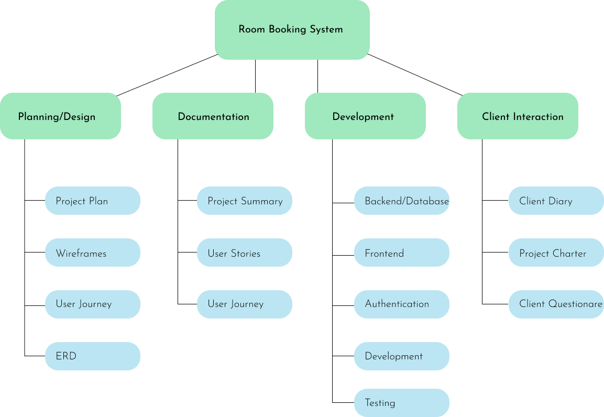
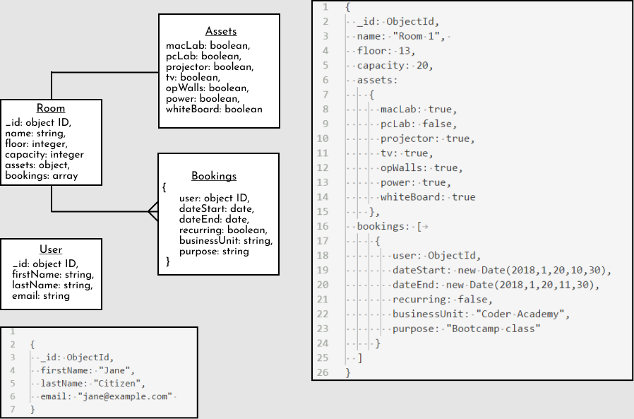
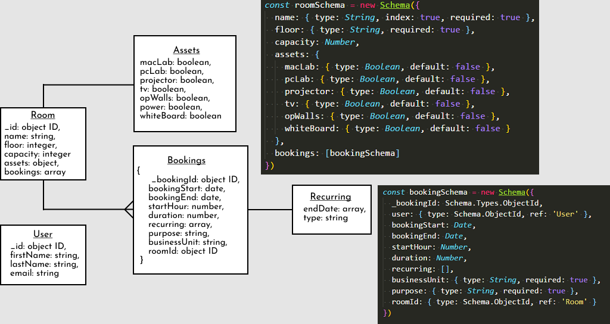
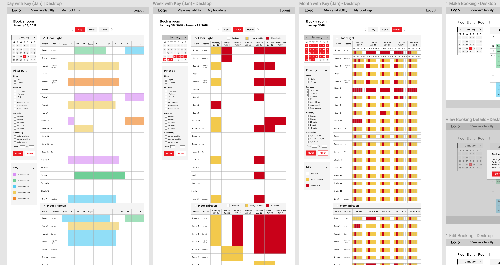
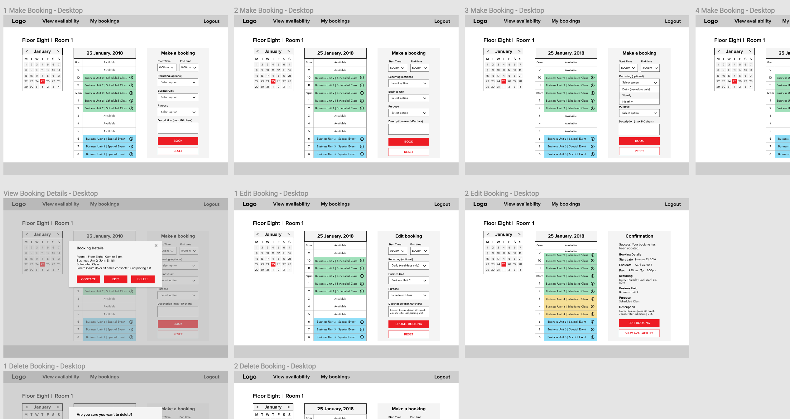

# Meeting-Hall Booking System
A room booking system built with MongoDB, Express, Node.js and ReactJS.


## Getting started
These instructions will get you a copy of the project up and running on your local machine for development purposes.
### Prerequisites
#### Back-end:
- MongoDB
- Express
- Node.js

```json
  "dependencies": {
    "body-parser": "^1.18.2",
    "cors": "^2.8.4",
    "express": "^4.16.2",
    "jsonwebtoken": "^8.1.0",
    "moment": "^2.20.1",
    "moment-timezone": "^0.5.14",
    "mongoose": "^4.13.9",
    "passport": "^0.4.0",
    "passport-google-oauth20": "^1.0.0",
    "passport-jwt": "^3.0.1",
    "passport-local": "^1.0.0",
    "passport-local-mongoose": "^4.4.0"
  },
  "devDependencies": {
    "dotenv": "^4.0.0",
    "eslint": "^4.15.0",
    "eslint-config-prettier": "^2.9.0",
    "eslint-config-standard": "^11.0.0-beta.0",
    "eslint-plugin-import": "^2.8.0",
    "eslint-plugin-node": "^5.2.1",
    "eslint-plugin-prettier": "^2.4.0",
    "eslint-plugin-promise": "^3.6.0",
    "eslint-plugin-standard": "^3.0.1",
    "nodemon": "^1.14.10",
    "now": "^9.2.7",
    "prettier": "^1.10.2"
  }
```
#### Front-end:
- React.js
```json
  "dependencies": {
    "axios": "^0.17.1",
    "jwt-decode": "^2.2.0",
    "moment": "^2.20.1",
    "moment-timezone": "^0.5.14",
    "normalize.css": "^7.0.0",
    "query-string": "^5.0.1",
    "react": "^16.2.0",
    "react-datetime": "^2.11.1",
    "react-dom": "^16.2.0",
    "react-modal": "^3.1.11",
    "react-router-dom": "^4.2.2",
    "react-scripts": "1.0.17"
  },
    "devDependencies": {
    "autoprefixer-stylus": "^0.14.0",
    "concurrently": "^3.5.1",
    "stylus": "^0.54.5"
  }
```
### Installation

Change to the `api` folder and install development and production dependencies.
```
cd api
yarn install
```
Change to the `web` folder and install development and producation dependencies.
```
cd web
yarn install
```
You will need to set up MongoDB & Seed the data
```
yarn seed
```
Go to the `api` folder and start the server.
```
cd api
yarn dev
```

Go to the `web` folder and run the script start script.
```
cd api
yarn start
```

Open in your browser and navigate to http://localhost:3000. You access the back-end on http://localhost:7000.

## About 
You are to design, build, deploy, and present an application built for a real world customer.

There are forty rooms over two floors available for use by anyone for professional work. The booking of these rooms is currently managed using a basic spreadsheet system. 
This is a  web-based application that allows the client  to login from anywhere to easily, accurately and quickly make a bookings.

This will help to ensure that room resources are used as fully-utilised as possible, whilst avoiding double-bookings and other common user frustrations. It will also make room booking statistics available to the client's staff and management to assist their planning and decision-making.




### Audience
- Management staff
- Business unit representative
- Administration staff
- Teachers

##
**In order to** find a room with a projector, Mac Lab with a projector and  be able to apply multiple filters.

**In order to** find out who has booked a specific room.

**In order to** view future room bookings, & be able to select a date using a calendar or search for a date.

**In order to** find where a room is located, & view a floorplan with selected room easily identifiable.

**In order to** find a room that has enough chairs, *& be able to view room capacity.

#### Business Unit Representative

**In order to** easily book a room, & be able to view only available rooms.

**In order to** save time entering booking details, &* be able to quickly select predefined options.

**In order to** make a recurring booking, & specify a time slot over multiple days, months or a year.

**In order to** ensure that room allocation is flexible and amend errors in bookings,& be able to edit bookings, delete bookings (i.e. not just my own) and/or reassign bookings to different rooms.

**In order to** ensure my booking was successfully created, & be directed to a confirmation page.

order to** book a room that has twenty seats, & be able to see all the available rooms that have 20 or more seats.
### Entity Relationship Diagram

#### Version 1

#### Version 2

## Design
We designed the application to be an intuitive and simple, yet powerful way to navigate, analyse and create bookings. This ultimately enables the efficient use of resources.


#### Room View


#### Booking View


### Development
## Requirements
[x] Backend - Node.js
[x] Frontend - ReactJS
[x] MongoDB and Mongoose
[x] Authentication (Google OAuth)
[x] Authorisation
[x] Filtering capability
[x] User interface
[x] Deploye back-end, front-end and host database
[x] README

### Technologies
- Node.js
- Express
- MongoDB
- Mongoose
- React.js
- Moment.js
- MomentTimezone.js

## Challenges and final thoughts

### Challenges
- Filtering
- Validations
- JWT
- Working with dates and times

## Future developments
- Weekly and monthly views
- Searching
- User permissions
- Editing bookings

